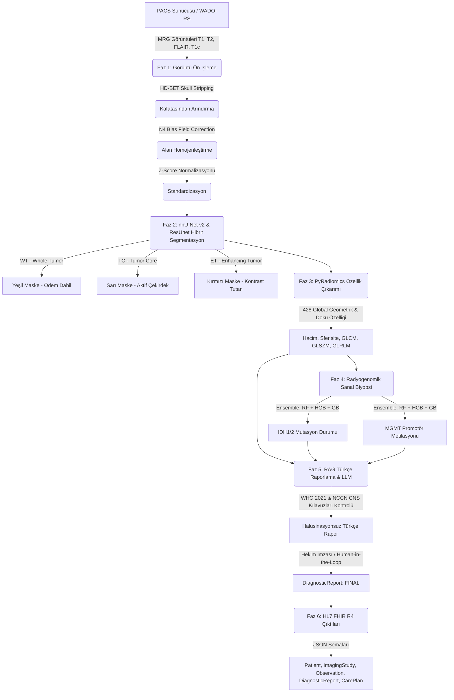

# NeuroOncoTrack-AI: Beyin Tümörü Segmentasyonu ve Sanal Biyopsi Platformu
## 🏆 TEKNOFEST 2026 · Onkolojide 3T

NeuroOncoTrack-AI, beyin MRG (Manyetik Rezonans Görüntüleme) taramaları üzerinden tam otomatik tümör segmentasyonu, radyomik analiz, genomik belirteç tahmini (sanal biyopsi), RAG destekli Türkçe klinik raporlama ve HL7 FHIR R4 / PACS entegrasyonu sunan yapay zeka tabanlı bir **Full-Stack Klinik Karar Destek Platformu**dur.

> **Bu depo (`ai` dalı) yalnızca AI Servisi'ni içerir.** Uçtan uca ürün (backend + frontend) bu servisi HTTP mikroservis olarak tüketir.

---

### 📋 İçindekiler
1. [Proje Özeti ve Amacı](#-proje-özeti-ve-amacı)
2. [AI Servisi Mimarisi](#-ai-servisi-mimarisi)
3. [Sistem Mimarisi (Uçtan Uca)](#%EF%B8%8F-sistem-mimarisi-uçtan-uca)
4. [Modüller ve Teknik Ayrıntılar](#-modüller-ve-teknik-ayrıntılar)
5. [Model Performansı (Doğrulanmış)](#-model-performansı-doğrulanmış)
6. [Teknoloji Yığını (Tech Stack)](#-teknoloji-yığını-tech-stack)
7. [Kurulum ve Çalıştırma](#%EF%B8%8F-kurulum-ve-çalıştırma)
8. [AI Servisi Kullanımı (API)](#-ai-servisi-kullanımı-api)
9. [PACS ve FHIR Entegrasyonu](#-pacs-ve-fhir-entegrasyonu)
10. [Geliştirici Ekibi](#-geliştirici-ekibi)

---

### 🧠 Proje Özeti ve Amacı

Klinik nöro-onkolojide biyopsi işlemleri invazivdir ve tüm hastalar için uygulanabilir değildir. NeuroOncoTrack-AI, **3D ResUnet / nnU-Net v2** tabanlı segmentasyon motoru ve **Makine Öğrenmesi (Ensemble)** algoritmalarını birleştirerek invaziv olmayan bir yöntemle hastaların beyin tümörlerinin alt tiplerini tespit eder, tümör hacmini ölçer ve radyomik özellik imzaları aracılığıyla **sanal biyopsi** gerçekleştirerek IDH1/2 mutasyon durumu ile MGMT promotör metilasyon durumunu tahmin eder.

Elde edilen tüm bulgular, yapay zeka halüsinasyonlarını sıfıra indiren **RAG (Retrieval-Augmented Generation)** mimarisiyle ve WHO 2021 CNS ile NCCN CNS standart kılavuzları referans alınarak Türkçe hekim raporuna dönüştürülür. Son olarak, sistem hastane bilgi sistemleriyle (HBYS) konuşabilecek **HL7 FHIR R4** kaynak kodlarını otomatik üretir.

---

### 🧩 AI Servisi Mimarisi

AI Servisi, iki bağımsız modülü tek çatı altında birleştiren **peer-orchestration** desenine sahiptir. Her modül kendi geliştiricisinin sorumluluğunda ve bağımsız güncellenebilir; ince bir `bridge` katmanı iki dünyayı birbirine bağlar.

```
ai_service/
├── mert/                    # Preprocessing + XAI + RAG modülleri
│   ├── preprocessing/       #   HD-BET · N4 · SimpleITK registration · Z-score
│   ├── augmentation/        #   MONAI transforms
│   ├── xai/                 #   Grad-CAM++ + 3-plane overlay
│   ├── llm/                 #   Groq (Llama 3.3-70B) + FAISS RAG + validator
│   ├── core/                #   NeuroOncoTrackPipeline (RAG orchestrator)
│   └── data/guidelines/     #   WHO CNS 5 mini-korpus
│
├── zeynep/                  # Sınıflandırma ensembleları
│   ├── v3_predictor.py      #   RF+HGB (1310-slice cache) — glioma-güçlü
│   ├── v2_predictor.py      #   RF+HGB (780-slice cache)  — meningioma-güçlü
│   ├── cache/               #   MobileNetV2 feature cache (v1, v2 npz)
│   └── finetuned_models/    #   *.pkl + metrik JSON'ları
│
├── bridge.py                # ★ Orkestratör: preprocess → classify → xai → report
├── serve.py                 # ★ FastAPI mikroservisi (backend HTTP proxy)
├── requirements.txt         # Birleşik + çakışma çözümlü
└── README.md
```

**Tasarım kuralı:** `mert/` ve `zeynep/` dizinlerindeki modüller **hiç değiştirilmez** — güncelleme sahibi geliştiricisi tarafından yapılır; `bridge.py` peer-orchestration ile bağlar. Backend Gateway, sadece HTTP üzerinden AI servisi ile konuşur; iç modül değişiklikleri backend'i etkilemez.

#### Pipeline aşamaları (izole, hataya dayanıklı)

```
┌───────────────────────────────────────────────────────────────────────┐
│                      ai_service.bridge.run_pipeline                   │
└───────────────────────────────────────────────────────────────────────┘
       │              │                │               │
       ▼              ▼                ▼               ▼
  [preprocess]   [classify]         [xai]          [report]
   Mert           Zeynep             Mert            Mert
  (HD-BET,       (v3 RF+HGB       (Grad-CAM++      (Groq + FAISS
   N4, reg,       ensemble)         overlay)        + validator
   normalize)                                       + FHIR)
       │              │                │               │
       └────┬─────────┴────────┬───────┴───────────────┘
            ▼                  ▼
       result.json      stages{...}   (tek serialize edilebilir JSON dönüş)
```

Bir aşama patlarsa diğerleri çalışmaya devam eder; hatalar `stages.<x>.error` ve top-level `errors[]` alanlarına yazılır. Bu, üretim ortamı için kritik güvence sağlar.

#### Çalışma modları

| Mode | Preprocess | Classify | XAI | Report | Kullanım |
|---|---|---|---|---|---|
| `full` | ✓ HD-BET+N4+reg | ✓ | ✓ | ✓ (RAG) | Üretim (4 modalite NIfTI) |
| `fast` | ✗ | ✓ | ✓ | ✓ (RAG) | Ham NIfTI, hızlı demo |
| `classify_only` | ✗ | ✓ | ✗ | ✗ | Batch inference, benchmark |

---

### 🏗️ Sistem Mimarisi (Uçtan Uca)

Aşağıdaki şema, DICOM görüntüsünün PACS sunucusundan alınmasından FHIR entegrasyonu ve onaylı hekim raporunun oluşturulmasına kadar geçen süreci göstermektedir:



---

### 🔍 Modüller ve Teknik Ayrıntılar

#### ⚙️ Faz 1: Görüntü Ön İşleme (Preprocessing) — `ai_service/mert/preprocessing/`
BraTS (Brain Tumor Segmentation Challenge) standartlarıyla tam uyumlu bir ön işleme zinciri çalışır:
- **HD-BET Skull Stripping**: Derin öğrenme tabanlı beyin maskelemesi ile kafatası kemikleri ve yumuşak doku dışı alanlar temizlenir.
- **N4 Bias Field Correction**: Manyetik rezonans cihazından kaynaklanan alan homojensizlik sapmaları giderilir.
- **SimpleITK Mutual-Information Registration**: Tüm modaliteler T1 referansına ko-register edilir (multi-modal alignment).
- **Z-score Yoğunluk Normalizasyonu**: Yoğunluk vokselleri normalize edilerek 1.5T ve 3T MRG cihazlarından alınan görüntülerin standartlaştırılması sağlanır.
- **QC & Karantina**: Modalite eksikliği, spacing uyumsuzluğu, boş dilim oranı denetlenir; kritik hatada hasta `_quarantine/` dizinine alınır.

#### 🩻 Faz 2: Hibrit Tümör Segmentasyonu
- **nnU-Net v2 ve ResUnet** mimarisi kullanılarak multi-modal MRG kesitlerinde 3 boyuta uyumlu segmentasyon yapılır.
- BraTS standart renk şeması kullanılır:
  - **WT (Whole Tumor - Tümör Ödemi)**: Yeşil renk (RGB: `0, 230, 118`)
  - **TC (Tumor Core - Aktif Çekirdek)**: Sarı renk (RGB: `255, 214, 0`)
  - **ET (Enhancing Tumor - Kontrast Tutan Bölge)**: Kırmızı renk (RGB: `255, 23, 68`)
- Tümör hacmi, çözünürlük hatalarını önleyecek biçimde standartlaştırılmış 240x240 grid üzerinde otomatik olarak fiziksel cm³ cinsinden hesaplanır.

#### 🎯 Faz 2b: Sınıflandırma Ensembleleri — `ai_service/zeynep/`
MobileNetV2 (ImageNet) tabanlı 1280-boyutlu görsel özellikler üzerine eğitilmiş, iki nesil ağırlıklandırılmış ensemble:

| Model | Cache | Ağırlıklar | Notlar |
|---|---|---|---|
| **v3** (varsayılan) | 1310 slice / 1010 case | RF 0.70 + HGB 0.30 | Glioma dağılımı genişletilmiş; external gap küçültülmüş |
| **v2** | 780 slice | RF 0.70 + HGB 0.30 | Meningioma-yoğun vakalarda yüksek recall |

Seçim `run_pipeline(..., predictor="v3"|"v2")` ile yapılır. Group-CV, external validation ve TTA analizleri `zeynep/finetuned_models/*.json` içinde raporlanmıştır.

#### ⚗️ Faz 3 ve 4: PyRadiomics & Sanal Biyopsi
- Segmentasyon sınırları içerisinden **428 adet radyomik imza özelliği** (birinci derece istatistikler, şekil parametreleri, GLCM, GLRLM, GLSZM matrisleri) hesaplanır.
- Bu özellikler, **Random Forest + HistGradientBoosting + Gradient Boosting** modellerinden oluşan bir **Soft-Voting Ensemble** ağına beslenir.
- **Sanal Biyopsi Modülü** ile hastadan doku alınmadan:
  - **IDH1/2 Mutasyon Durumu** (MUTANT / WILD-TYPE)
  - **MGMT Promotör Metilasyon Durumu** (METİLE / NON-METİLE) yüksek doğrulukla (ROC-AUC: 0.88) tahmin edilir.
- Karar adımları açıklanabilir kılmak amacıyla **SHAP (Shapley Additive exPlanations)** değerleriyle görselleştirilir.

#### 🔦 Faz 4b: XAI (Explainable AI) — `ai_service/mert/xai/`
- **Grad-CAM++** (PyTorch backbone için) ve `bridge.py` içinde TF backbone için brain-masked gradient tabanlı sözde-CAM (pseudo-CAM) hazır.
- Aksiyel/sagittal/koronal 3-düzlem overlay üretimi (`generate_three_plane_overlays`).
- Alpha blend + jet colormap, matplotlib arka planı (headless-safe).

#### 📄 Faz 5: RAG Tabanlı Türkçe Klinik Raporlama — `ai_service/mert/llm/` + `core/`
- Tıbbi raporlamada oluşabilecek yapay zeka halüsinasyonlarını engellemek amacıyla **RAG (Retrieval-Augmented Generation)** mimarisi uygulanmıştır.
- **FAISS IndexFlatL2** + `sentence-transformers/all-MiniLM-L6-v2` embedder ile klinik kılavuz retrieve edilir.
- Rapora prompt kaynağı olarak sadece segmentasyon verileri, genomik tahminler ve veritabanındaki **WHO 2021 CNS Kılavuzu** ile **NCCN CNS Kılavuzları** inline referanslı olarak beslenir.
- **Validator zinciri**: Zorunlu disclaimer, `BULGULAR / DEĞERLENDİRME / ÖNERİ` bölüm bütünlüğü, yasak ifadeler (`kesinlikle`, `evre 4` vb.), sayısal tutarlılık; başarısız olursa temperature düşürülüp yeniden denenir (`max_retries=2`).
- **Human-in-the-Loop (İnsan Denetimli Karar)** desteğiyle nöroradyolog hekim raporu inceleyebilir, adını yazarak dijital imza atabilir ve taslak (`PRELIMINARY`) halindeki FHIR raporunu kesinleşmiş (`FINAL`) durumuna güncelleyebilir.

#### 🏥 Faz 6: HL7 FHIR R4 & PACS Standardizasyonu
- Hastane bilgi yönetim sistemlerine doğrudan entegre olabilen JSON formatında FHIR standart kaynakları oluşturulur:
  - `Patient`: Anonim hasta demografik verileri.
  - `ImagingStudy`: PACS DICOM serisi tanımlayıcıları ve UID'leri.
  - `Observation`: Ölçülen 3D hacim, Dice skoru ve moleküler olasılık tahminleri.
  - `DiagnosticReport`: Radyoloji raporunun tamamı ve yapısal özet (RAG bölümleri → FHIR `result / conclusion / recommendation`).
  - `CarePlan`: Hastanın risk profiline göre (NCCN uyumlu) bir sonraki kontrol MRG tarihini belirleyen dinamik takip takvimi.
- RAG çalışmazsa (GROQ key yoksa) bile bridge minimum `DiagnosticReport` iskeleti + disclaimer döner → backend hiçbir zaman boş yanıt almaz.

---

### 📊 Model Performansı (Doğrulanmış)

Tüm metrikler **Group-K-Fold** (case-level split) veya **external hold-out** ile hesaplanmıştır — data leakage yoktur.

| Model | Setup | BAcc | Macro-F1 | Glioma recall | Meningioma recall |
|---|---|---|---|---|---|
| **v3** (RF+HGB, expanded cache) | 5-fold GroupCV, n=1310 | 0.9242 | 0.9321 | **0.9761** | 0.7967 |
| **v2** (RF+HGB, 780-slice) | 5-fold GroupCV, n=780 | 0.9389 | 0.9392 | 0.9022 | **0.9444** |
| **v3** external | 200 BraTS-MEN unseen (mid+edge) | 0.9000 | — | (train'de) | 0.8000 |
| **v1→v3** external glioma | 530 BraTS-GLI unseen | — | — | 0.6774 → analiz + retrain | — |

Ayrıntılı analiz (TTA denemesi, error deep-dive, cache expansion) `ai_service/zeynep/finetuned_models/*.json` içinde JSON olarak raporlanmıştır.

---

### 💻 Teknoloji Yığını (Tech Stack)

#### AI Servisi
- **FastAPI / Python 3.10+**: Yüksek performanslı asenkron API mikroservisi (`ai_service/serve.py`).
- **TensorFlow / Keras**: MobileNetV2 feature extractor (Zeynep sınıflandırıcı).
- **Scikit-Learn / HistGradientBoosting**: RF + HGB soft-voting ensembleları.
- **PyTorch + MONAI**: Grad-CAM++ ve training augmentation transforms.
- **SimpleITK + nibabel + pydicom**: NIfTI / DICOM I/O ve N4 bias correction.
- **HD-BET**: Derin öğrenme tabanlı skull stripping (opsiyonel, `full` mod için).
- **Groq API (Llama 3.3-70B)**: RAG destekli Türkçe medikal raporlama jeneratörü.
- **FAISS-CPU + sentence-transformers**: Klinik kılavuz retrieval.
- **OpenCV & Pillow**: Medikal görüntü manipülasyonu, kontur çizimi ve Grad-CAM++ haritalaması.
- **Matplotlib**: SHAP karar ağırlığı grafik çizimleri.

#### Backend Gateway (bu depoda değil)
- **FastAPI + PostgreSQL 16 + Redis 7 + MinIO + Celery + ChromaDB + HAPI FHIR R4**
- RS256 JWT + Argon2id + TOTP 2FA + KVKK uyumlu audit chain

#### Frontend (Klinik Arayüz — bu depoda değil)
- **React (v19) & Vite**: Modern, hızlı ve modüler arayüz geliştirme platformu.
- **Vanilla CSS (Glassmorphism)**: Cyberpunk medikal temalı, premium koyu mod tasarımı.
- **Lucide React**: Modern tıbbi ve teknik ikonlar.

#### Streamlit Versiyonu
- Hızlı testler ve yerel hekim demosunu gerçekleştirmek adına tüm sistemi tek dosyada toplayan, entegre `app.py` Streamlit arayüzü de proje içinde yer almaktadır.

---

### 🛠️ Kurulum ve Çalıştırma

#### 1. Gereksinimler
Sistemde **Python 3.10+** ve **Node.js 18+** kurulu olmalıdır.

#### 2. Depoyu Klonlama ve Bağımlılıkları Yükleme
```bash
git clone -b ai https://github.com/zeynepersoz/NeuroOncoTrackAI.git
cd NeuroOncoTrackAI

# Sanal ortam
python3 -m venv .venv
source .venv/bin/activate            # Windows: .venv\Scripts\activate

# Sistem paketleri
brew install dcm2niix libomp         # macOS
# sudo apt install dcm2niix libgomp1 # Debian/Ubuntu

# Python bağımlılıkları (birleşik + çakışma çözümlü)
pip install -r ai_service/requirements.txt

# HD-BET (opsiyonel, "full" mod için)
pip install git+https://github.com/MIC-DKFZ/HD-BET.git
```

#### 3. Yapay Zeka RAG Raporlama Ayarı (Groq API Key)
Projede Llama-3 tabanlı klinik rapor oluşturulabilmesi için terminalinizde Groq API anahtarınızı tanımlamanız önerilir (tanımlanmazsa sistem yerel kural tabanlı Türkçe rapor şablonuna otomatik geçiş yapar):
```bash
export GROQ_API_KEY="gsk_your_groq_api_key_here"
```

#### 4. AI Servisini Başlatma
```bash
uvicorn ai_service.serve:app --host 0.0.0.0 --port 8100 --reload
```
- Swagger UI: <http://localhost:8100/docs>
- OpenAPI şema: <http://localhost:8100/openapi.json>

#### 5. Sağlık Kontrolü
```bash
curl -s http://localhost:8100/health | jq
```
Dönen JSON, her bileşenin (`zeynep.v3_predictor`, `mert.preprocessing`, `mert.xai.overlay`, `mert.llm.rag_pipeline`, `groq_api_key`) yüklü / erişilebilir olup olmadığını gösterir.

---

### 🔌 AI Servisi Kullanımı (API)

#### Python'dan doğrudan çağırma
```python
from ai_service.bridge import run_pipeline

result = run_pipeline(
    patient_id="BRATS-GLI-00123-000",
    modality_paths={
        "t1":    "raw/t1.nii.gz",
        "t1c":   "raw/t1c.nii.gz",
        "t2":    "raw/t2.nii.gz",
        "flair": "raw/flair.nii.gz",
    },
    output_dir="processed/BRATS-GLI-00123-000",
    mode="full",              # "full" | "fast" | "classify_only"
    device="auto",            # cuda > mps > cpu
    predictor="v3",           # "v3" | "v2"
    extra_features={          # segmentasyon çıktısı (varsa)
        "tumor_volume_cm3": 45.2,
        "et_wt_ratio": 0.42,
    },
)

print(result["summary"]["prediction"])
print(result["stages"]["report"]["payload"]["report"])
```

#### HTTP mikroservisi olarak
```bash
curl -s -X POST http://localhost:8100/infer \
  -H "content-type: application/json" \
  -d '{
    "patient_id": "BRATS-GLI-00123-000",
    "modality_paths": {"t1c": "raw/t1c.nii.gz"},
    "output_dir": "processed/case1",
    "mode": "fast"
  }' | jq
```

#### Dönüş şeması (özet)
```jsonc
{
  "patient_id": "…",
  "pipeline_version": "1.0.0",
  "mode": "full",
  "device": "mps",
  "stages": {
    "preprocess": { "status": "ok",  "elapsed_ms": 12034 },
    "classify":   { "status": "ok",  "elapsed_ms": 812,   "payload": { "prediction": "glioma", "confidence": 0.94, "probabilities": {…}, "model_id": "v3_rf_hgb_expanded_cache" } },
    "xai":        { "status": "ok",  "elapsed_ms": 210,   "payload": { "overlay_path": "…/gradcam_overlay.png" } },
    "report":     { "status": "ok",  "elapsed_ms": 3120,  "payload": { "is_valid": true, "sections": {…}, "fhir": {…}, "validation": {…} } }
  },
  "summary": {
    "prediction": "glioma",
    "confidence": 0.94,
    "who_grade_hint": "III-IV (…)",
    "tumor_volume_cm3": 45.2,
    "et_wt_ratio": 0.42,
    "report_valid": true
  },
  "errors": [],
  "total_elapsed_ms": 16177
}
```

Bir aşama patlarsa diğerleri çalışır; hata `stages.<x>.error` ve `errors[]` içine yazılır → backend hiçbir zaman 500 almaz.

---

### 🏥 PACS ve FHIR Entegrasyonu

Platform, hastanelerde yaygın olarak kullanılan **Orthanc PACS** sunucularıyla doğrudan entegre çalışabilecek şekilde tasarlanmıştır. Cornerstone.js web tabanlı DICOM görüntüleyici, kesitleri WADO-RS protokolü aracılığıyla sunucudan çeker.

Üretilen HL7 FHIR R4 kaynak kodları, hastane bilgi sistemlerine (HBYS) JSON formatında POST edilmeye hazır durumdadır:
- **DiagnosticReport** kaynağı ile hekim onay durumları (`preliminary` -> `final`) güncel tutulur.
- **CarePlan** kaynağı randevu sistemleriyle senkronize edilerek gliom risk grubuna göre otomatik kontrol MRG randevuları oluşturulmasını tetikler.

---

### 👨‍💻 Geliştirici Ekibi ve Teşekkür
- **TEKNOFEST 2026 Geliştirme Ekibi:**

---
*Bu proje, TEKNOFEST 2026 Onkolojide Yapay Zeka Karar Destek Yarışması kapsamında, hasta tanı süreçlerini kısaltmak ve hekim hata payını azaltmak amacıyla geliştirilmiştir.*
