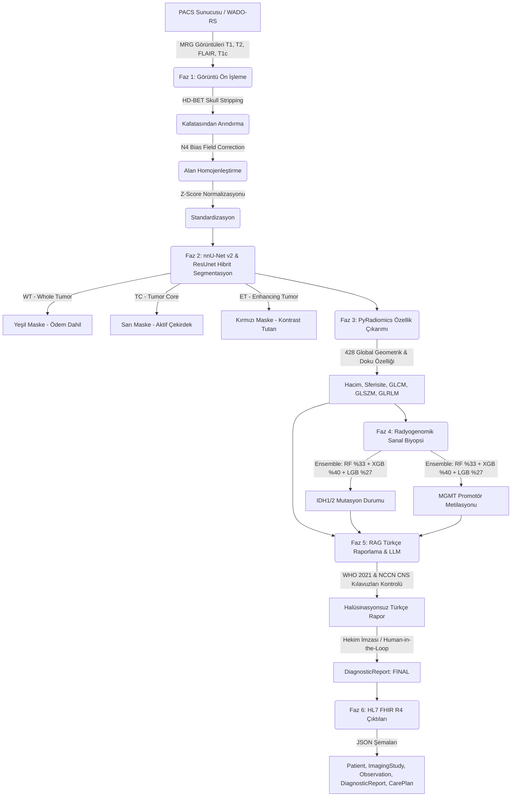

#NeuroOncoTrack-AI: Beyin Tümörü Segmentasyonu ve Sanal Biyopsi Platformu
## 🏆 TEKNOFEST 2026 · Onkolojide 3T 

NeuroOncoTrack-AI, beyin MRG (Manyetik Rezonans Görüntüleme) taramaları üzerinden tam otomatik tümör segmentasyonu, radyomik analiz, genomik belirteç tahmini (sanal biyopsi), RAG destekli Türkçe klinik raporlama ve HL7 FHIR R4 / PACS entegrasyonu sunan yapay zeka tabanlı bir **Full-Stack Klinik Karar Destek Platformu**dur.

---

### 📋 İçindekiler
1. [Proje Özeti ve Amacı](#-proje-özeti-ve-amacı)
2. [Sistem Mimarisi](#-sistem-mimarisi)
3. [Modüller ve Teknik Ayrıntılar](#-modüller-ve-teknik-ayrıntılar)
4. [Teknoloji Yığını (Tech Stack)](#-teknoloji-yığını-tech-stack)
5. [Kurulum ve Çalıştırma](#%EF%B8%8F-kurulum-ve-çalıştırma)
6. [PACS ve FHIR Entegrasyonu](#-pacs-ve-fhir-entegrasyonu)
7. [Geliştirici Ekibi](#-geliştirici-ekibi)

---

### 🧠 Proje Özeti ve Amacı

Klinik nöro-onkolojide biyopsi işlemleri invazivdir ve tüm hastalar için uygulanabilir değildir. NeuroOncoTrack-AI, **3D ResUnet/nnU-Net v2** tabanlı segmentasyon motoru ve **Makine Öğrenmesi (Ensemble)** algoritmalarını birleştirerek invaziv olmayan bir yöntemle hastaların beyin tümörlerinin alt tiplerini tespit eder, tümör hacmini ölçer ve radyomik özellik imzaları aracılığıyla **sanal biyopsi** gerçekleştirerek IDH1/2 mutasyon durumu ile MGMT promotör metilasyon durumunu tahmin eder.

Elde edilen tüm bulgular, yapay zeka halüsinasyonlarını sıfıra indiren **RAG (Retrieval-Augmented Generation)** mimarisiyle ve WHO 2021 CNS ile NCCN CNS standart kılavuzları referans alınarak Türkçe hekim raporuna dönüştürülür. Son olarak, sistem hastane bilgi sistemleriyle (HBYS) konuşabilecek **HL7 FHIR R4** kaynak kodlarını otomatik üretir.

---

### 🏗️ Sistem Mimarisi

Aşağıdaki şema, DICOM görüntüsünün PACS sunucusundan alınmasından FHIR entegrasyonu ve onaylı hekim raporunun oluşturulmasına kadar geçen süreci göstermektedir:



---

### 🔍 Modüller ve Teknik Ayrıntılar

#### ⚙️ Faz 1: Görüntü Ön İşleme (Preprocessing)
BraTS (Brain Tumor Segmentation Challenge) standartlarıyla tam uyumlu bir ön işleme zinciri çalışır:
- **HD-BET Skull Stripping**: Derin öğrenme tabanlı beyin maskelemesi ile kafatası kemikleri ve yumuşak doku dışı alanlar temizlenir.
- **N4 Bias Field Correction**: Manyetik rezonans cihazından kaynaklanan alan homojensizlik sapmaları giderilir.
- **Z-score Yoğunluk Normalizasyonu**: Yoğunluk vokselleri normalize edilerek 1.5T ve 3T MRG cihazlarından alınan görüntülerin standartlaştırılması sağlanır.

#### 🩻 Faz 2: Hibrit Tümör Segmentasyonu
- **nnU-Net v2 ve ResUnet** mimarisi kullanılarak multi-modal MRG kesitlerinde 3 boyuta uyumlu segmentasyon yapılır.
- BraTS standart renk şeması kullanılır:
  - **WT (Whole Tumor - Tümör Ödemi)**: Yeşil renk (RGB: `0, 230, 118`)
  - **TC (Tumor Core - Aktif Çekirdek)**: Sarı renk (RGB: `255, 214, 0`)
  - **ET (Enhancing Tumor - Kontrast Tutan Bölge)**: Kırmızı renk (RGB: `255, 23, 68`)
- Tümör hacmi, çözünürlük hatalarını önleyecek biçimde standartlaştırılmış 240x240 grid üzerinde otomatik olarak fiziksel cm³ cinsinden hesaplanır.

#### ⚗️ Faz 3 ve 4: PyRadiomics & Sanal Biyopsi
- Segmentasyon sınırları içerisinden **428 adet radyomik imza özelliği** (birinci derece istatistikler, şekil parametreleri, GLCM, GLRLM, GLSZM matrisleri) hesaplanır.
- Bu özellikler, **Random Forest (%33)**, **Gradient Boosting (%40)** ve **LightGBM (%27)** modellerinden oluşan bir **Soft-Voting Ensemble** ağına beslenir.
- **Sanal Biyopsi Modülü** ile hastadan doku alınmadan:
  - **IDH1/2 Mutasyon Durumu** (MUTANT / WILD-TYPE)
  - **MGMT Promotör Metilasyon Durumu** (METİLE / NON-METİLE) yüksek doğrulukla (ROC-AUC: 0.88) tahmin edilir.
- Karar adımları açıklanabilir kılmak amacıyla **SHAP (Shapley Additive exPlanations)** değerleriyle görselleştirilir.

#### 📄 Faz 5: RAG Tabanlı Türkçe Klinik Raporlama
- Tıbbi raporlamada oluşabilecek yapay zeka halüsinasyonlarını engellemek amacıyla **RAG (Retrieval-Augmented Generation)** mimarisi uygulanmıştır.
- Rapora prompt kaynağı olarak sadece segmentasyon verileri, genomik tahminler ve veritabanındaki **WHO 2021 CNS Kılavuzu** ile **NCCN CNS Kılavuzları** inline referanslı olarak beslenir.
- **Human-in-the-Loop (İnsan Denetimli Karar)** desteğiyle nöroradyolog hekim raporu inceleyebilir, adını yazarak dijital imza atabilir ve taslak (`PRELIMINARY`) halindeki FHIR raporunu kesinleşmiş (`FINAL`) durumuna güncelleyebilir.

#### 🏥 Faz 6: HL7 FHIR R4 & PACS Standardizasyonu
- Hastane bilgi yönetim sistemlerine doğrudan entegre olabilen JSON formatında FHIR standart kaynakları oluşturulur:
  - `Patient`: Anonim hasta demografik verileri.
  - `ImagingStudy`: PACS DICOM serisi tanımlayıcıları ve UID'leri.
  - `Observation`: Ölçülen 3D hacim, Dice skoru ve moleküler olasılık tahminleri.
  - `DiagnosticReport`: Radyoloji raporunun tamamı ve yapısal özet.
  - `CarePlan`: Hastanın risk profiline göre (NCCN uyumlu) bir sonraki kontrol MRG tarihini belirleyen dinamik takip takvimi.

---

### 💻 Teknoloji Yığını (Tech Stack)

#### Backend (Sunucu & Yapay Zeka Hattı)
- **FastAPI / Python**: Yüksek performanslı asenkron API sunucusu.
- **TensorFlow / Keras**: MobileNetV2 ve ResUnet modellerinin yüklenmesi ve çıkarımı.
- **Scikit-Learn / LightGBM / XGBoost**: Ensemble makine öğrenmesi modelleri.
- **OpenCV & Pillow**: Medikal görüntü manipülasyonu, kontur çizimi ve Grad-CAM++ haritalaması.
- **Matplotlib**: SHAP karar ağırlığı grafik çizimleri.
- **Groq API (Llama 3 8B)**: RAG destekli Türkçe medikal raporlama jeneratörü.

#### Frontend (Klinik Arayüz)
- **React (v19) & Vite**: Modern, hızlı ve modüler arayüz geliştirme platformu.
- **Vanilla CSS (Glassmorphism)**: Cyberpunk medikal temalı, premium koyu mod tasarımı.
- **Lucide React**: Modern tıbbi ve teknik ikonlar.

#### Streamlit Versiyonu
- Hızlı testler ve yerel hekim demosunu gerçekleştirmek adına tüm sistemi tek dosyada toplayan, entegre `app.py` Streamlit arayüzü de proje içinde yer almaktadır.

---

### 🛠️ Kurulum ve Çalıştırma

#### 1. Gereksinimler
Sistemde **Python 3.10+** ve **Node.js 18+** kurulu olmalıdır.

#### 2. Depoyu Klonlama ve Bağımlılıkları Yükleme
```bash
# Depoyu klonlayın
git clone https://github.com/moataz-nageh/Brain-Tumor-Detection.git
cd Brain-Tumor-Detection

# Python sanal ortamı oluşturun ve aktifleştirin
python -m venv .venv
source .venv/bin/activate  # Windows için: .venv\Scripts\activate

# Python kütüphanelerini yükleyin
pip install -r requirements.txt

# React Frontend bağımlılıklarını yükleyin
cd frontend
npm install
cd ..
```

#### 3. Yapay Zeka RAG Raporlama Ayarı (Groq API Key)
Projede Llama-3 tabanlı klinik rapor oluşturulabilmesi için terminalinizde Groq API anahtarınızı tanımlamanız önerilir (tanımlanmazsa sistem yerel kural tabanlı Türkçe rapor şablonuna otomatik geçiş yapar):
```bash
export GROQ_API_KEY="gsk_your_groq_api_key_here"
```

#### 4. macOS / Linux Üzerinde Hızlı Başlatma
Proje dizininde yer alan `baslat_mac.command` dosyasını terminalden çalıştırabilir veya Finder üzerinden çift tıklayarak sistemi tek adımda ayağa kaldırabilirsiniz:
```bash
chmod +x baslat_mac.command
./baslat_mac.command
```
Bu script:
1. FastAPI Backend'i `http://127.0.0.1:8000` adresinde başlatır.
2. React Frontend'i `http://127.0.0.1:5173` adresinde başlatır.
3. Servislerin PID'lerini saklar ve terminalde `Ctrl+C` yapıldığında arka plandaki tüm işlemleri temizleyerek güvenle kapatır.

#### 5. Manuel Başlatma (Tüm Platformlar)
**FastAPI Backend:**
```bash
uvicorn backend.main:app --host 127.0.0.1 --port 8000 --reload
```
**React Frontend:**
```bash
cd frontend
npm run dev
```

**Streamlit Yerel Arayüzü (Alternatif Çalıştırma):**
```bash
streamlit run app.py
```

---

### 🏥 PACS ve FHIR Entegrasyonu

Platform, hastanelerde yaygın olarak kullanılan **Orthanc PACS** sunucularıyla doğrudan entegre çalışabilecek şekilde tasarlanmıştır. Cornerstone.js web tabanlı DICOM görüntüleyici, kesitleri WADO-RS protokolü aracılığıyla sunucudan çeker.

Üretilen HL7 FHIR R4 kaynak kodları, hastane bilgi sistemlerine (HBYS) JSON formatında POST edilmeye hazır durumdadır:
- **DiagnosticReport** kaynağı ile hekim onay durumları (`preliminary` -> `final`) güncel tutulur.
- **CarePlan** kaynağı randevu sistemleriyle senkronize edilerek gliom risk grubuna göre otomatik kontrol MRG randevuları oluşturulmasını tetikler.

---

### 👨‍💻 Geliştirici Ekibi ve Teşekkür
- **TEKNOFEST 2026 Geliştirme Ekibi:**

---
*Bu proje, TEKNOFEST 2026 Onkolojide Yapay Zeka Karar Destek Yarışması kapsamında, hasta tanı süreçlerini kısaltmak ve hekim hata payını azaltmak amacıyla geliştirilmiştir.*
